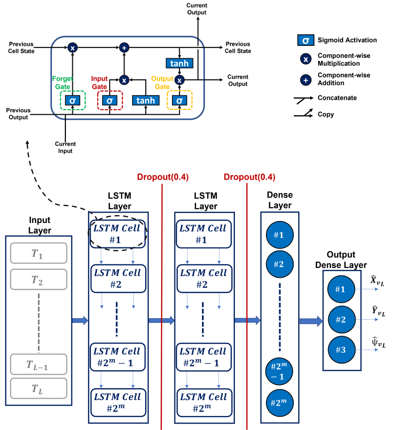

# LSTM-enhanced Predictive Display for Wireless Underwater Teleoperation Under Time Delays
This repository contains the implementation for the paper "LSTM-enhanced Predictive Display for Wireless Underwater Teleoperation Under Time Delays," submitted to OCEANS 2025 Brest Conference.

Underwater Remotely Operated Vehicles (ROVs) controlled via acoustic communication offer greater maneuverability by eliminating tether constraints, but suffer from significant time delays that hinder operator performance. This work introduces a delay mitigation method using a Predictive Display (PD) enhanced by a Long Short-Term Memory (LSTM) neural network. The PD predicts the ROV's delayed movements using both a dynamic model and LSTM-based time series forecasting, then displays a virtual robot in real-time, enabling the operator to navigate more intuitively despite the delay. Experiments conducted with a bioinspired robotic fish and visual positioning system validate the system's effectiveness in delay-heavy environments up to 2.5 seconds, with additional support from haptic collision alerts.

## UUV Simulation Files
- [UUV Simulation Files for the Fish Robot](https://drive.google.com/drive/folders/1wbEwfnN-eox4PKkyHqJEYRunemAo_VPK)

## Visual Positioning System
- [Robot Fish Detection Image Dataset](https://drive.google.com/drive/folders/1juCn09KQ54zcEOWjtXYbTc1OVoKAaRFt?usp=drive_link)
- [Marker Detection Image Dataset](https://drive.google.com/drive/folders/1juCn09KQ54zcEOWjtXYbTc1OVoKAaRFt?usp=drive_link)
- [YOLOv5 Weights](https://drive.google.com/drive/folders/1-LfieJBtS7hA1OjDda0Tv0-7SggqRUWC?usp=drive_link)
- [Detection and Logging Codes](Codes)

## LSTM Network
- [LSTM Network](Codes)

